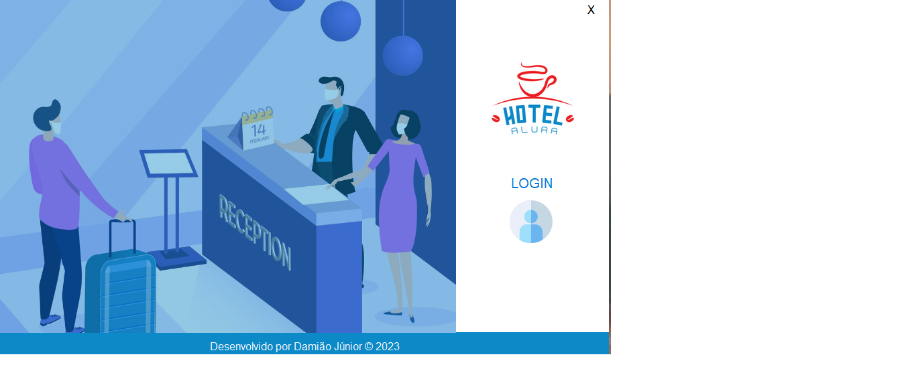
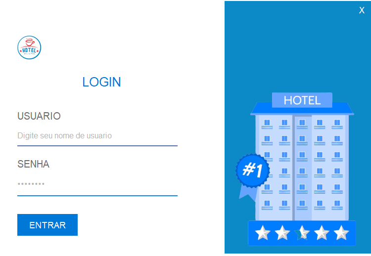
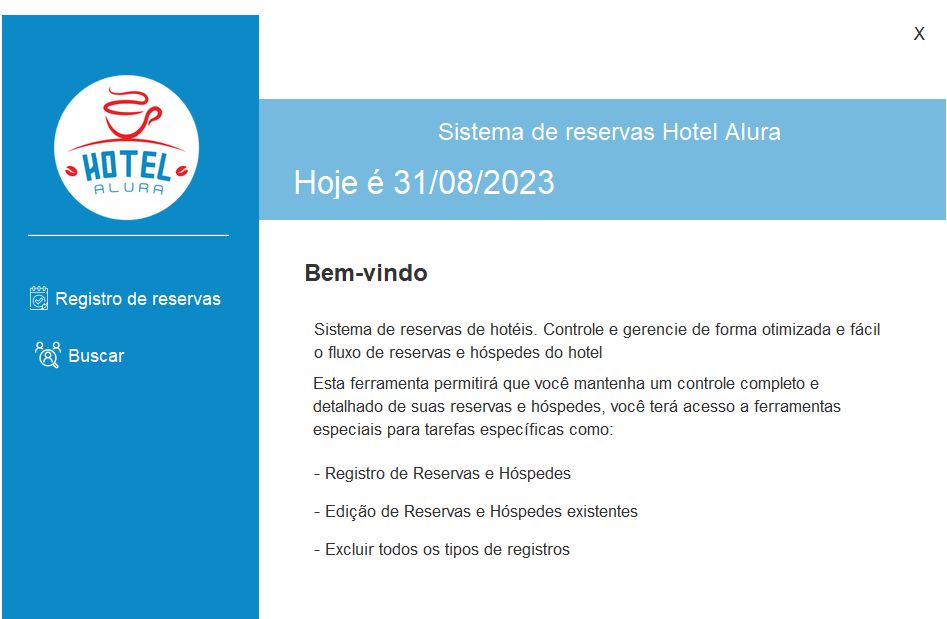
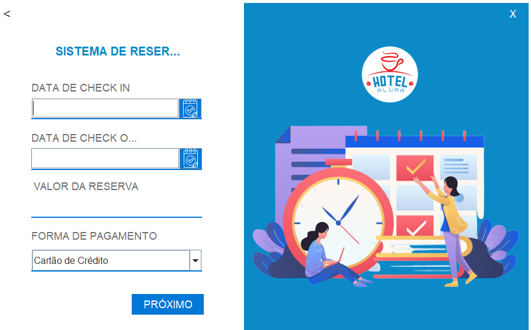
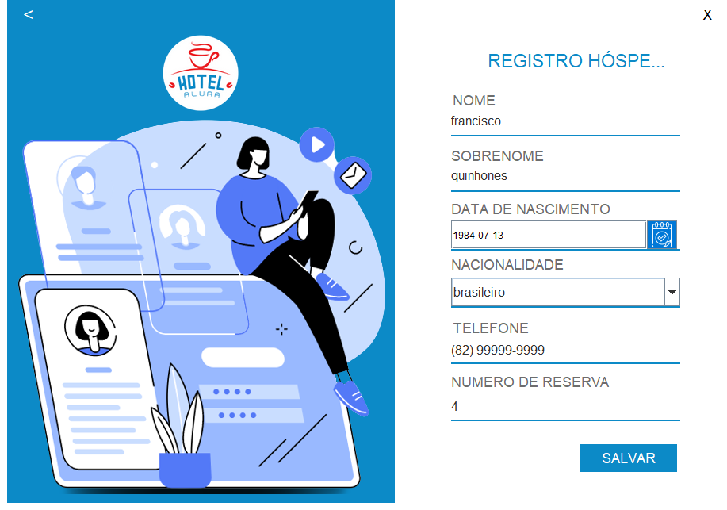
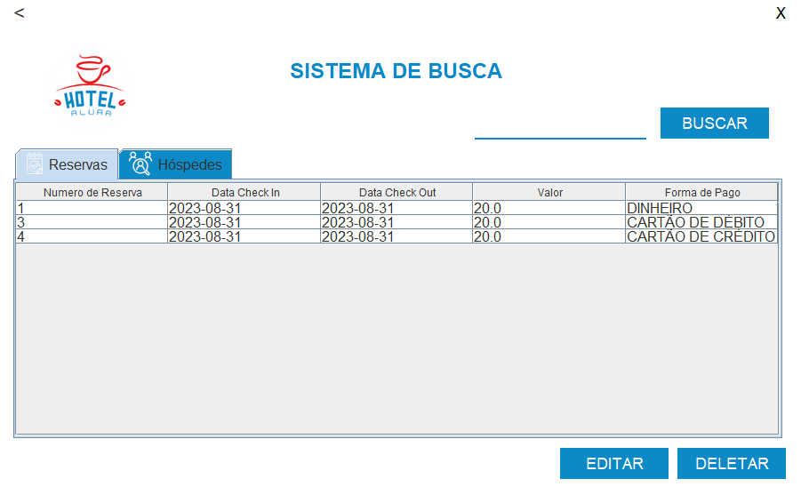
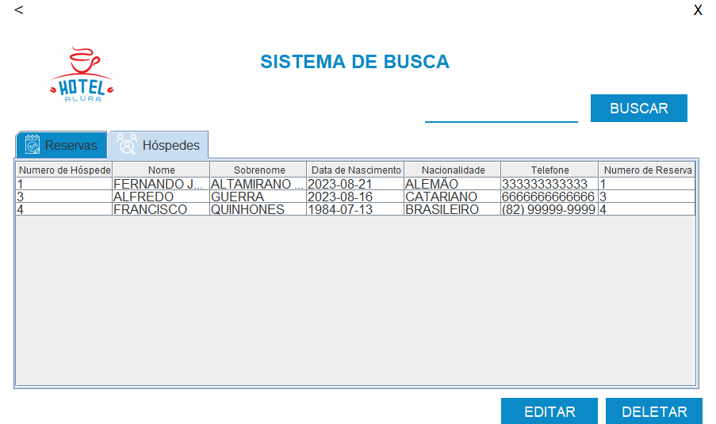

<h1> Este é o Hotel Alura</h1>

 Este projeto foi desenvolvido na linguagem Java para a conclusão de um dos challengers da formação Oracle One Next Education, parceria da Oracle com a Alura.

<h2>O que este App Faz?</h2>

Trata-se de um aplicativo para gerenciamento de reservas de um hotel. O app realiza o cadastro de hóspedes e reservas, consultas das reservas e hóspedes cadastrados, assim como a edição e exclusão dos dados.

<h2>Tecnologias utilizadas</h2>
<ul>
 <li>Java SDK 20</li>
 <li>Java Swing</li>
 <li>Java JDBC</li>
 <li>Java C3P0 Pool</li>
 <li>MySql 8.0</li>
</ul>

<h2>Como Rodar o Projeto?</h2>

<h2>Telas do APP</h2>

<h3>Tela Principal</h3>

<h3>Tela de Login</h3>

<h3>Tela Menu</h3>

Nesta tela o usuário pode escolher se deseja cadastrar uma reserva ou consultar uma reserva já registrada.

<h3>Tela de Cadastro de Reservas</h3>

Aqui o usuário preenche os dados da reserva e o valor é calculado automaticamente, levando em consideração o número de dias entre a data de entrada e saída e o valor da diária que está fixado em R$20,00

<h3>Tela de Cadastro de Hospedes</h3>

Aqui o usuário preenche os dados do hóspede. O número da reserva não pode ser mudado, pois o valor é resgatado da tabela reservas.

<h3>Tela de Buscas</h3>

Aqui o usuário consulta as reservas cadastradas. O usuário pode editar o deletar a reserva e pode buscar uma reserva pelo ID

Podem ser feitos os mesmos comandos de editar e deletar,semelhante a tabela reservas. Aqui as buscas são feitas pelo sobrenome.

<h2>Considerações finais</h2>

A finalidade do projeto foi desenvolver as habilidades aprendidas no curso de  Formação Java e Spring Boot - ONE , com enfase no CRUD(Create, read,update, delete). O repositório segue público para contribuições. Obrigado!
# HotelAluraFernando

